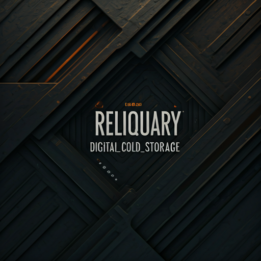

<p align="center">
  
</p>

# Reliquary

A cold storage system for forgotten artifacts.

Most data is disposable.
Some should survive time.

Reliquary preserves what the world discards.

> Artifacts stored in the Reliquary are rarely important. But importance changes with time.

## Features

- **Multi-file upload** with progress tracking, duplicate detection (SHA-256), and download support
- **Thumbnail generation** for images (resize) and videos (ffmpeg first-frame extraction)
- **Multi-user support** with admin/user roles and per-user isolated storage
- **Lifecycle archival** — automatically archive files older than a configurable threshold
- **Storage analytics** — file counts, storage usage by type and month
- **Configurable server URL** — connect to different Reliquary instances (portable drive support)
- **Responsive UI** — bottom navigation on mobile, sidebar on desktop, industrial design theme
- **All file types supported** — images, videos, documents, archives, etc.
- **Cross-platform** — web, Android, iOS, Linux desktop

## Development

### Prerequisites

- [Nix](https://nixos.org/) with flakes enabled
- [tmux](https://github.com/tmux/tmux) (optional, for the `dev` launcher script)

### Quick Start

The fastest way to start all services (requires tmux):

```bash
nix develop
dev
```

This launches infra, backend (with hot reload), and frontend in separate tmux windows. Use `Ctrl-b` + window number to switch between them.

### Manual Start

Enter the development shell:

```bash
nix develop
```

This sets up all dependencies (Go, Flutter, MinIO, Caddy, ffmpeg, process-compose) and generates the process-compose configuration.

You can also enter a focused shell for a specific layer:

```bash
nix develop .#backend    # Go + infra tooling
nix develop .#frontend   # Flutter + infra tooling
nix develop .#infra      # Infra tooling only
```

### Infrastructure

Start the infrastructure services (MinIO + Caddy reverse proxy):

```bash
start-infra
```

In a separate terminal (inside the dev shell), load the ports into your environment:

```bash
source load-infra-env
```

This exports `MINIO_PORT`, `MINIO_CONSOLE_PORT`, and `PROXY_PORT` for use by other services.

Stop all infrastructure services:

```bash
shutdown-infra
```

The Caddy reverse proxy runs on `http://localhost:2080` and routes:
- `/api/*` → Go backend (unix socket)
- `/storage/*` → MinIO (for presigned file downloads)

### Backend

The backend is a Go API server located in `backend/`. It provides JWT authentication, multi-user management, multipart file upload to MinIO, deduplication, thumbnail generation, lifecycle archival, and storage analytics.

```bash
start-backend            # loads env, runs air (hot reload) on unix socket
```

Or manually:

```bash
cd backend
source load-infra-env
LISTEN_ADDR=$DATA_DIR/backend.sock air    # or: go run .
```

The server listens on a unix socket by default for use with the Caddy proxy. For direct TCP access, use `PORT=8080 go run .` instead.

#### API Endpoints

| Method | Endpoint | Auth | Description |
|--------|----------|------|-------------|
| POST | `/api/login` | No | Returns JWT token with username and role |
| GET | `/api/health` | No | Health check |
| POST | `/api/upload` | Yes | Multipart file upload with dedup |
| GET | `/api/files?offset=0&limit=50` | Yes | List files (paginated) |
| GET | `/api/files/presign?key=...&download=true` | Yes | Presigned download URL (`download=true` forces save) |
| DELETE | `/api/files?key=...` | Yes | Delete file and thumbnail |
| GET | `/api/archive?offset=0&limit=50` | Yes | List archived files |
| POST | `/api/archive/restore?key=...` | Yes | Restore from archive |
| POST | `/api/archive/run` | Yes | Trigger archival manually |
| DELETE | `/api/archive?key=...` | Yes | Delete archived file |
| GET | `/api/stats` | Yes | Storage analytics |
| GET | `/api/admin/stats` | Admin | Aggregate analytics |
| POST | `/api/admin/users` | Admin | Create user |
| GET | `/api/admin/users` | Admin | List users |
| DELETE | `/api/admin/users/{username}` | Admin | Delete user |
| PUT | `/api/admin/users/{username}/password` | Admin* | Change password |

*Admin can change any password; users can change their own.

Default credentials: `admin` / `admin` (configurable via `AUTH_USERNAME`, `AUTH_PASSWORD` env vars).

#### Configuration

| Env Var | Default | Description |
|---------|---------|-------------|
| `LISTEN_ADDR` | `:8080` | Listen address (path = unix socket) |
| `AUTH_USERNAME` | `admin` | Initial admin username |
| `AUTH_PASSWORD` | `admin` | Initial admin password |
| `THUMBNAIL_WORKERS` | `4` | Concurrent thumbnail workers |
| `ARCHIVE_AFTER_DAYS` | `90` | Days before auto-archival |
| `ARCHIVE_CHECK_HOURS` | `24` | Hours between archival scans |

### Frontend

The frontend is a Flutter application located in `frontend/`. It targets web, Android, iOS, and Linux desktop.

```bash
start-frontend           # runs flutter web server on port 3000
```

Or manually:

```bash
cd frontend
flutter run -d web-server    # Web (open in any browser)
flutter run -d linux         # Linux desktop
flutter run -d chrome        # Chrome (set CHROME_EXECUTABLE for Firefox)
```

Features:
- Login with JWT authentication (multi-user) and server URL configuration
- Multi-file upload with progress tracking and duplicate detection
- Thumbnail gallery with tap-to-view full resolution
- File download, details, and delete via long-press menu
- Content-type aware file icons (image, video, audio, PDF, archive)
- File metadata display (checksum, upload date, original name)
- Archive browser with restore and permanent delete
- Storage analytics dashboard
- Admin user management (create, delete, change password)
- Configurable server URL (login screen + settings)
- Responsive layout: bottom navigation (mobile), sidebar (desktop)
- Change password (settings screen)

## Deployment

### Build

Requires [Nix](https://nixos.org/) with flakes enabled and [Docker](https://docs.docker.com/get-docker/) or [Podman](https://podman.io/).

```bash
# 1. Build the container image (includes MinIO, Go backend, Caddy, ffmpeg)
nix build .#container
docker load < result

# 2. Build the Flutter web frontend
cd frontend
flutter build web --release
cd ..

# 3. Copy the web build into the container
docker create --name reliquary-tmp reliquary:latest
docker cp frontend/build/web/. reliquary-tmp:/srv/web/
docker commit reliquary-tmp reliquary:latest
docker rm reliquary-tmp
```

Or use the deploy script which does all of the above (auto-detects docker/podman):

```bash
./bin/deploy
```

### Run

```bash
# Copy and edit the environment file
cp .env.example .env
# Edit .env with your production values (especially JWT_SECRET and passwords)

# Start (docker or podman)
docker compose up -d
# or: podman compose up -d
```

The application is available at `http://localhost:2080`.

### Configuration

All configuration is via environment variables in `.env`:

| Variable | Default | Description |
|----------|---------|-------------|
| `RELIQUARY_PORT` | `2080` | Host port to expose |
| `MINIO_ROOT_USER` | `minioadmin` | MinIO admin username |
| `MINIO_ROOT_PASSWORD` | `minioadmin` | MinIO admin password |
| `MINIO_BUCKET` | `reliquary` | MinIO bucket name |
| `AUTH_USERNAME` | `admin` | Initial admin username |
| `AUTH_PASSWORD` | `admin` | Initial admin password |
| `JWT_SECRET` | — | JWT signing secret (must change for production) |
| `THUMBNAIL_WORKERS` | `4` | Concurrent thumbnail workers |
| `ARCHIVE_AFTER_DAYS` | `90` | Days before auto-archival |
| `ARCHIVE_CHECK_HOURS` | `24` | Hours between archival scans |

### Architecture

The container runs three processes managed by the entrypoint script:
- **MinIO** — object storage on `127.0.0.1:9000` (internal only)
- **Go backend** — API server on a unix socket
- **Caddy** — reverse proxy on `:2080`, serves Flutter web build, routes `/api/*` and `/storage/*`

MinIO data is persisted via a Docker volume (`minio_data`).

### Mobile Apps

Build native apps that connect to your Reliquary instance:

```bash
cd frontend

# Android
flutter build apk --release

# iOS (requires macOS + Xcode)
flutter build ipa --release
```

Set the server URL on the login screen to point to your deployment (e.g., `http://192.168.1.100:2080`).
