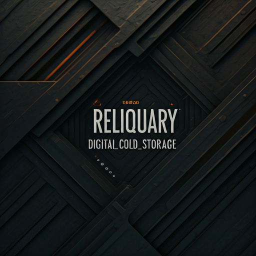
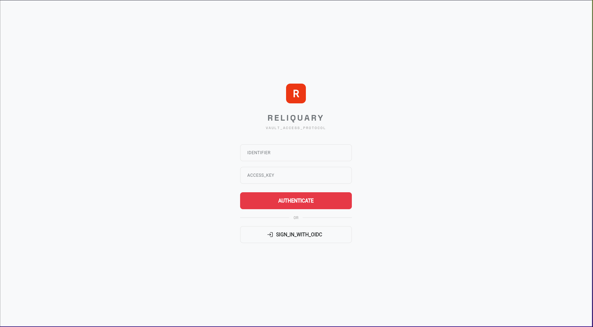
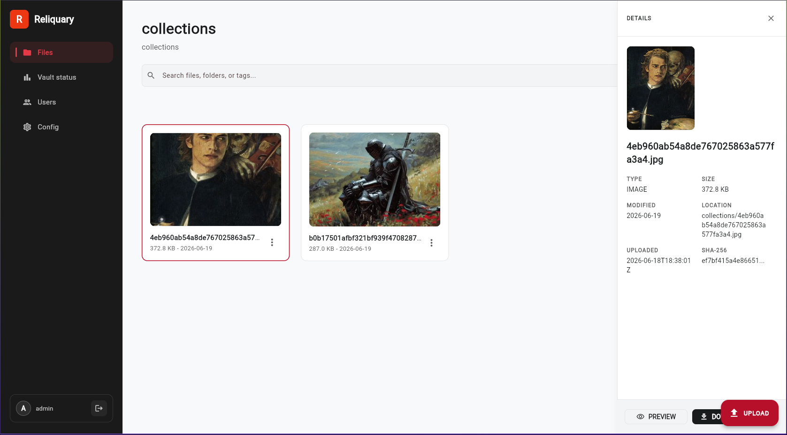
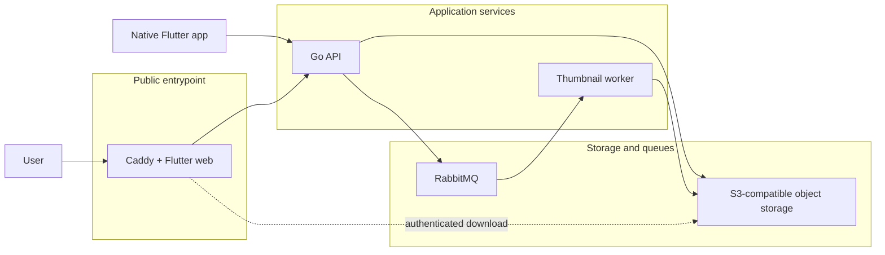

<p align="center">
  
</p>

# Reliquary

A cold storage system for forgotten artifacts.

Most data is disposable. Some should survive time.

Reliquary preserves what the world discards.

> Artifacts stored in the Reliquary are rarely important. But importance changes with time.

## Preview

<p align="center">
  
</p>

<p align="center">
  
</p>

## What is it for?

Reliquary is for the files that do not need a full productivity suite around
them, but still deserve a durable place to live: old photos, videos, document
exports, backups, project archives, downloaded media, and other digital things
that may not feel important today.

There are already many capable self-hosted file platforms, such as Nextcloud
and Seafile. Reliquary is intentionally smaller in scope. It is not trying to be
a collaboration suite, document editor, sync client, calendar, or general cloud
workspace. The main idea is simpler: provide a quiet archive where you can put
old files, browse them when needed, and otherwise forget about them.

The storage layer is built on the S3-compatible API so Reliquary does not need
to own the hard part of durable object storage. The examples use MinIO, but the
same idea can work with AWS S3, Cloudflare R2, Backblaze B2, or self-hosted
backends such as SeaweedFS, Garage, MinIO, or Ceph.

## What It Does

Reliquary is an opinionated frontend and API for S3-compatible storage. It keeps
the user-facing workflow focused on storing files, finding them later, previewing
common media types, and understanding how the archive is growing over time.

Instead of exposing every storage feature directly, Reliquary adds the pieces
that make cold storage pleasant for personal use: uploads with duplicate
detection, thumbnails, a searchable file explorer, per-user isolation, and simple
storage analytics.

## Architecture


```mermaid
flowchart LR
  user[User]
  native[Native Flutter app]

  subgraph ingress[Public entrypoint]
    web[Caddy + Flutter web]
  end

  subgraph app[Application services]
    api[Go API]
    worker[Thumbnail worker]
  end

  subgraph infra[Storage and queues]
    s3[S3-compatible object storage]
    mq[RabbitMQ]
  end

  user --> web
  native --> api
  web --> api

  api --> s3
  api --> mq
  mq --> worker
  worker --> s3

  web -. authenticated download .-> s3
```

The web deployment exposes Caddy as the public entrypoint. Caddy serves the
Flutter web app, proxies API requests to the Go backend, and proxies storage
downloads. The API owns authentication, file metadata, uploads,
deduplication, user isolation, and analytics. Background thumbnail work is
published through RabbitMQ and processed by the worker, while file contents,
thumbnails, indexes, and user data live in S3-compatible object storage.
Every storage download is checked by Caddy's `forward_auth` against the
backend before bytes are served, so presigned URLs cannot be used without a
valid reliquary session owning the object.

## Features

- Multi-file upload with progress tracking and SHA-256 duplicate detection, so
  identical files are stored once and duplicate uploads are skipped even when the
  filename is different
- Thumbnail generation for images and videos
- File explorer with search, sorting, details, preview, download, and delete
- Storage analytics by file type and month
- Local username/password auth, OIDC auth, trusted proxy auth, or no-auth mode
- Per-user storage isolation in standalone password-auth mode
- Responsive web UI with mobile and desktop layouts
- Deployable as split containers with MinIO, RabbitMQ, API, worker, and web ingress
- Native Flutter targets for Android, iOS, Linux desktop, and web

## Getting Started

For a normal self-hosted deployment, use the Docker Compose setup:

```bash
cp .env.example .env
docker compose up -d
```

### Building the image

```bash
nix develop
./bin/deploy
```

Before exposing the service, edit `.env` and change the default secrets and
passwords.

The app is available at `http://localhost:2080` by default.

## Documentation

- [Deployment](docs/deployment.md)
- [Development](docs/development.md)
- [API Reference](docs/api-reference.md)
- [Authentication](docs/authentication.md)
- [Split-Container Deployment](docs/split-container-deployment.md)

## Platforms

Reliquary ships as a web app in the default deployment. Native Flutter builds
can also connect to a Reliquary server URL; see [Deployment](docs/deployment.md)
for build details.

## Contributing

Contributions are welcome, especially fixes and improvements that keep Reliquary
focused on simple, durable personal file storage.

Before opening a pull request:

- Keep changes scoped and avoid adding broad platform features unless they fit
  the cold-storage idea.
- Follow the existing Go and Dart style. Use `gofmt` for backend code and
  `dart format` for frontend code.
- Add focused tests for behavior changes when practical.
- Run the relevant checks before submitting:

```bash
cd backend && go test ./...
cd frontend && flutter test
cd frontend && flutter analyze
```

For local setup, service commands, and build details, see
[Development](docs/development.md).

## License

See the repository license.
